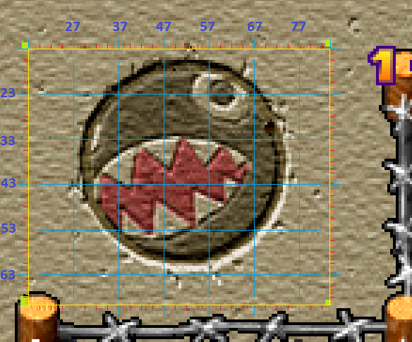
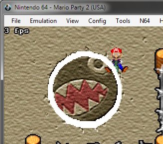
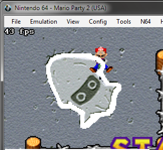
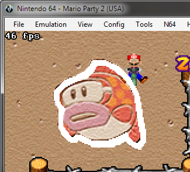
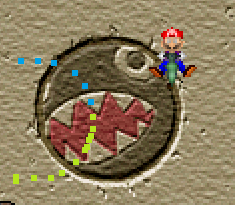
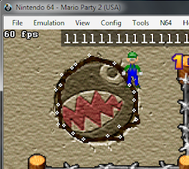

# 13: Crazy Cutters

### Introduction

This is a 4v4 mini-game in Mario Party 2. Using the joystick, players must trace a path around a border of a given image. Whichever player's path is closest to the border of the image wins the game. There are 3 variants of this minigame depending on the shape that needs to be traced (chain-chomp, blooper, or cheep cheep).

### Player Position

The game keeps track of the last 60 x and y positions of each player (for the bob-omb course). For example, for player 1:

|Memory range|Description|
|------------|-----------|
1FBCC8-1FBDB4| Player 1’s x position from newest -> oldest [1FBA78 for the squid]
1FBDB8-1FBEA4| Player 1’s y position from newest -> oldest
1FBEA8-1FBF1C| Player 1’s first 32 x positions from 32nd -> 1st
1FBF20-1FBF94| ?? (all zeros?)
1FBF98-1FC00C| Player 1’s first 32 y positions from 32nd -> 1st
1FC080-1FC0AC| Player 1’s x position from newest -> oldest (updates more frequently)
1FC0B0-1FC0D4| Player 1’s y position from newest -> oldest (updates more frequently)

The the x-y coordinates of each player's play area are given by

|Description|x-y coordinate|
|-|-|
|Top left corner| (0x17,0x13)|
|Bottom left corner| (0x17,0x6E)|
|Top right corner| (0x82,0x13)|
|Bottom right corner| (0x82,0x6E)|
|Starting position| (0x6E,0x31)|

For the top left corner player, this looks like 

### Scoring Track
There is a single path for each version of the minigame that the player must trace over to score points. The game makes a map that stores whether a certain position is on or off this track. The game stores a map of each point in the image to be traced and for each point, stores either 0x00 for a point off the track or 0xFF for a point on the track. The memory ranges of these maps are as follows:

|Variant|Range|
|-|-|
Chain-chomp|0x2173C0-0x21BF50
Blooper|0x217160-0x21BCF0
Cheep cheep|0x217410-20x1BFA0

The program searches through this map by multiplying the current y position by 0xA0 and adding the current x position to create the distance from the beginning of the map. The number of times the player is on track or off track is counted. If the byte that it lands on is 0xFF then the player is on the track and 1 is added to its ‘ON’ count, otherwise the player is off the track and 1 is added to the player’s ‘OFF’ count. Mapped out on the chomp course, the track (in white) looks like this:

Mapped for the Blooper course:

Mapped for the Cheep-cheep course:

### Score

In order to calculate the player's score, the game tracks two values: the number of frames the player travelled on the correct path (*ON*), and the number of frames travelled off the path (*OFF*).

The final score is largely based on the percentage of frames that the player stays on the track. Several adjustments are made, however, to encourage the player to complete the entire circuit.

The *punishment ratio* (*PR*) is calculated to prevent the player from travelling only a short distance on the track then ending their run. It is found by $PR = min\\{1,(ON+OFF)/500\\}$.

We can then calculate an intermediate value *a* by $a = PR\\cdot(\\frac{ON}{ON+OFF})\\cdot100 + 0.5$.

Scores below 95 are then inflated to look more impressive. A score multiplier is calculated, given by 

$$multiplier = \begin{cases} 
      1+(95 - max\\{a,80\\})/150 & a \leq 95 \\\
      1 & a > 95
 \end{cases}$$
 
 giving a maximum 10% bonus so the player's score.
 
Finally the total score is found by taking $a \cdot multipler$.

### Did you try hard enough?

In addition to reducing the score of short paths, the game will also award a score of 0 if the player never progressed far enough around the track. The player needs to enter a circular area (seen below) centered around the left edge of the play area at some point during their run. If they do not, the score is automatically zero. 

Code starting at 80104B04 is calculating the distance between the player and a point on the middle of the play area. When the player reaches a distance of 30 from that point, byte 5 from 109970 changes from A->B or 8->9 and that game is satisfied the player has tried hard enough.

### AI Track

The program stores somewhere around 20 pairs x and y coordinates for each player. Each one is stored as a run of x coordinates followed by some junk, then an equal run of y coordinates. The AI players move directly from one point to the next until a complete path is traced. I think the runs are stored in the stack so they appear at different places in memory each game.

In the above image, each circle is an AI path coordinate. Luigi goes from one to the next perfectly. 

Each point is generated randomly when the scene loads. First, game loads into memory the non-skewed version of the path (ie a perfect route) into memory starting around 0x1091A8. The points then get randomly skewed which creates the track that player AI follows.

For Player 1, memory at 0x109588 stores which point the AI has hit. It flips the corresponding bit each time the computer player hits one of the points.

